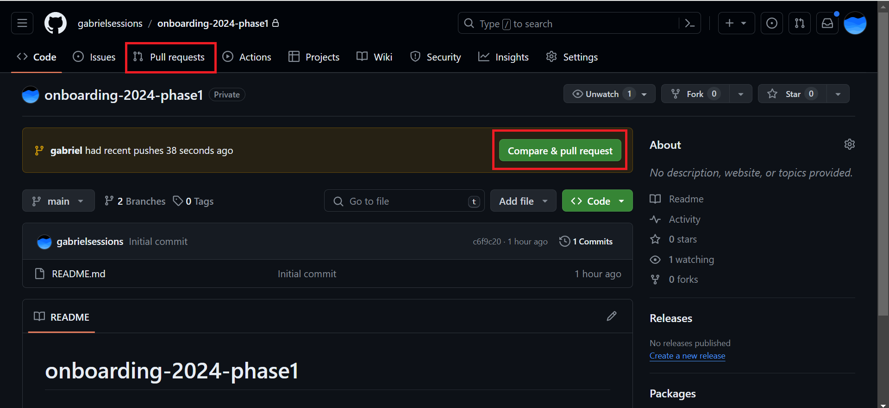
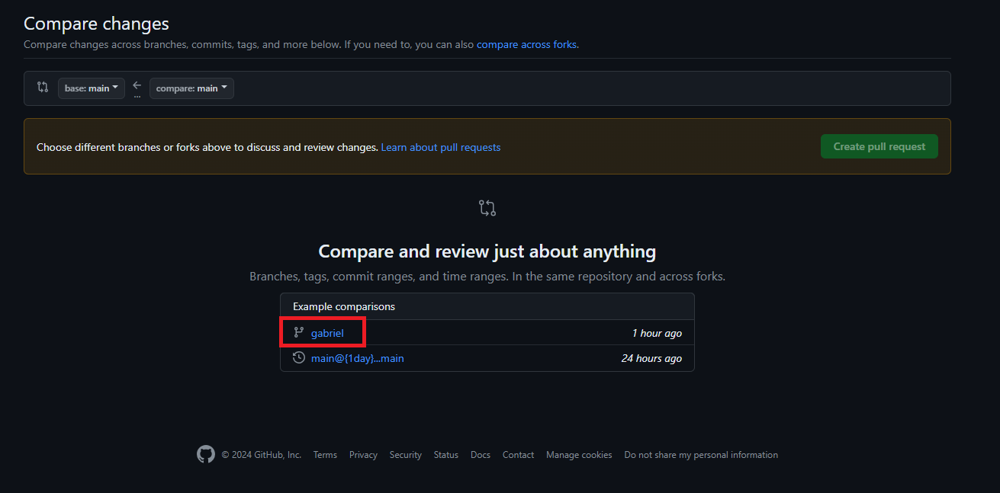
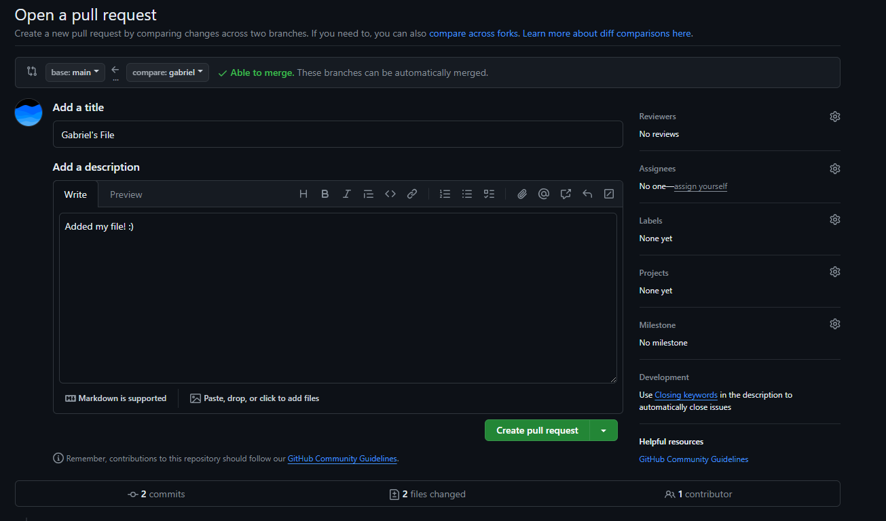
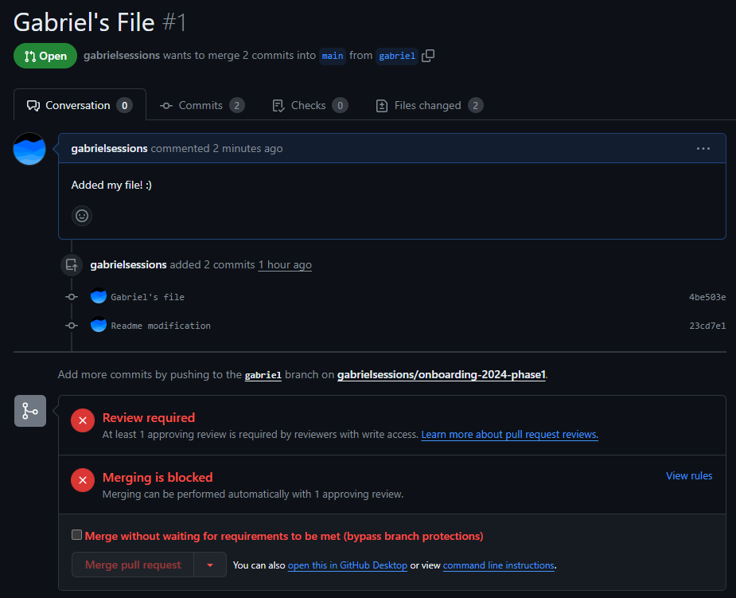

# Phase 1.1: Gitting Ready

Before you start coding, let's get our development environment set up. Here's what you'll need to start:
* GitHub Account
* Git
* Node.js and Node Package Manager (npm)
* Code Editor

## GitHub
If you don't already have one, create a GitHub account at [github.com](https://github.com/).

What is GitHub?
> - GitHub is a popular platform used to store, share, and deploy software.
> - GitHub uses git (see below) to easily track and manage changes from multiple developers.
> - Owned by Microsoft

## Git
Do you already have git installed? You can check by running \`\`\`git --version\`\`\`. 

If the command returns an error (command not found), you can download a git installer here: [Git Downloads](https://git-scm.com/downloads). Verify that git is properly installed by running \`git --version\`

What is git? How is it different from GitHub?
> - Git is a version control system critical to modern software development
> - Git manages multiple versions of your code with branches. If multiple developers are working on the same project, each developer creates their own branch. When finished, changes are merged together into a main/master branch.
> - Changes are stored on branches through a process of **staging** and **committing**
> - It's Open Source

## Node.js and Node Package Manager (npm)
Node.js is a JavaScript runtme that allows you to run JavaScript code outside of a browser. 

Already have Node installed? Run \`node --version\` to check. Ideally you should be running a supported version of Node (v18 or higher). 

Don't have Node installed? Download and install the [LTS (long term support) version of Node here](https://nodejs.org/en/download).

Have an old version of Node installed and want to upgrade? You can install a newer version from the [Node.js website](https://nodejs.org/en/download) or with [nvm](https://github.com/nvm-sh/nvm?tab=readme-ov-file#intro) (Node Version Manager).

## Code Editor
There's a lot of editors and IDEs to choose from. If you have a preferred editor, feel free to use it. We generally recommend Visual Studio Code (VSCode) for newer developers. You can download VSCode from their [official website](https://code.visualstudio.com/). 

If you're more experienced developer and are looking for a specialized editor that has too many features, check out [WebStorm](https://www.jetbrains.com/webstorm/). It's free for students!# Phase 1.2: Push, Pull, Commit, Branch

Let's start working with Git! Here's what we'll do:
  * Clone an Existing Repository
  * Create new branches
  * Stage and Commit changes
  * Pull/Push Changes
  
## Cloning the Starter Code
In a command line, change directories to a folder where you'd like to place the starter code. To clone the starter code for this phase run the command below. This will copy all of the reporsitory files and commit history to your local machine.

    git clone https://github.com/gabrielsessions/onboarding-2024-phase1.git

## Creating a new branch
In general, don't commit changes directly to the main branch. Create a new branch off of main whenever you have new changes to add. Here's the general process on how to create a new branch:

    git checkout main # Changes branch to main
    git pull # Pulls down latest changes on main
    git checkout -b my-branch-name # Create your new branch off of main

## Committing Changes
In your newly created branch, open up a code editor and create a new .txt file with your name. Include a fun fact about yourself in the txt file! Once you've saved the file with a fun fact, stage and commit your new file to the branch:

    git add . # Stages all files for a commit
    git commit -m "Your commit message here: Describe changes made to the codebase'

If all goes well, your changes will be committed locally. Now we need to push these changes to GitHub (remote).

    git push
    # The first time, this will likely spit back
    # a command that's \`git push --set-upstream ...\`.
    # Just copy and run that, it's a one-time thing.

Pushing to GitHub will require you to authenticate. Check out Ben's handy guide if you'd like to set up personal access tokens for authentication: [https://jumbocode.ben.page/reference/git-local](https://jumbocode.ben.page/reference/git-local)# Phase 1.3: Your First PR!

Before starting this part you should have completed the follwing:
- Cloned the Phase 1 repository
- Created a new branch and added a new file
- Pushed the new file to GitHub

Now head over to Phase 1 repo on [GitHub](https://github.com/gabrielsessions/onboarding-2024-phase1) and click on "Pull Requests". If you see a PR suggestion on the repo main page, feel free to click on that instead and skip the next few steps.

If you're on the PR menu, click the "New Pull Request" button and select your branch from the list of branches. On the branch page, create a new Pull Request (green button towards the top).

Fill out the form with a description of your PR contents and submit the PR

Congratulations! You've submitted your first PR!

You'll notice that you can't merge the changes in yourself. PRs need to be approved by your PM/TL. When you finish a PR, let them know so they can review your code and merge in your changes. You can add them as a "Reviewer" on the PR or ping them on Slack/text.

For this phase, add a PM/TL or Gabriel as a reviewer and we'll take a look at your code before merging it into the main branch.# Phase 2.1: Cracking the Code

Let's finally get into React! Start by cloning the starter code:

    git clone https://github.com/gabrielsessions/onboarding-2024-phase2.git

Then, boot up a development server to get a sense of what the website looks like! \`cd\` (change directory) into the cloned repository and create a new branch.

    cd onboarding-2024-phase2
    git checkout main
    git checkout -b my-branch-name

We need to install some packages in order for React to work. You can install them by running \`npm install\` in the \`onboarding-2024-phase2\` directory. After you've downloaded all required packages, run the development server using the command \`npm run dev\`. 

The development server should serve the website on [http://localhost:3000](http://localhost:3000). Head there and check out what's going on! What do you see?

Click on the link to the Phase 2.1 activity.

Let's dig into some code! The goal of the activity is to unlock the lock and change the pin. More specifically,

1. Find the code used to generate this page
2. Figure out what the code does
3. Find the passcode and unlock the lock
4. Change the lock pin to something else
5. Verify that the lock works with the new pin# Phase 2.2: Initializing Cards

Open up the Phase 2.2 page in the codebase and navigate to the page in your browser.

In the process of learning React, we'll build a partially complete implementation of the card game Uno! If you don't know how to play, here are the rules in [text](https://www.unorules.com/) and [video](https://www.youtube.com/watch?v=FkuqYtE1rw0) form.

Display a hand of cards using the Card component provided. We've have an example on how to display a card in the codebase. Create a starting hand of 5 predefined cards and display them on the Phase 2.2 page. We will be dynamically generating them later, so don't spend too much time getting everything perfect.

Your final hand should look something like this:
# Phase 2.3: JS Fundamentals

JavaScript/TypeScript syntax is similar to C/C++ syntax, but it's type system is much looser. A lot of your C/C++ knowledge will carry over. Learn X in Y has a very concise [overview of TypeScript](https://learnxinyminutes.com/docs/typescript/). 

What's the difference between JS and TS? 
- TypeScript is a superset of JavaScript: All valid JS code is valid TS code (but not the other way around). TS just adds a type system on top of JS which allows type safety and type checking. It's a quality-of-life upgrade to JS which allows us to catch errors earlier and faster.

Implement each of the following functions in the Phase 2.3 page

### Function 1: playable() - Check if an Uno card is playable
A Card is playable under standard Uno rules if it has the same color, value, or symbol as the top card of the discard pile or if it is a Wild Card.
    
    // Test Case
    const card = {
      color: "yellow",
      value: "7"
    }
    const topOfDiscardPile = {
      color: "red",
      value: "3"
    }
    console.log(playable(card, topOfDiscardPile)); // should print `false` to the console
    

### Function 2: playableCards() - Filter out all nonplayable cards
Takes an array of Card objects and the current discard card as an input. Return an array of only the playable cards from the input hand.

(Hint: Check out the JS `filter` function!)

    // Test Case:
    const hand = [{
      color: "yellow",
      value: "7"
    }, {
      color: "red",
      value: "8",
    }, {
      color: "blue",
      value: "Draw Two"
    }, {
      color: "wild",
      value: "Wild Draw Four"
    }]
    const topOfDiscardPile = {
      color: "red",
      value: "3"
    }
    console.log(playableCards(hand, topOfDiscardPile));
    /* Should Print Out
    [{
      color: "red",
      value: "8",
    }, {
      color: "wild",
      value: "Wild Draw Four"
    }]
    */

### Function 3: playCard(card, discardPile)
Attempt to play a card if it is playable If the card is playable, return a copy of the discard pile with the played card on top. Otherwise throw a runtime error of your choice.

    // Test Case
    const card = {
      color: "yellow",
      value: "7"
    }
    const discardPile = [{
      color: "blue",
      value: "7"
    }, {
      color: "green",
      value: "5"
    }]

    console.log(playCard(card, discardPile))
    /* Should Print Out
    [{
      color: "yellow",
      value: "7"
    }, {
      color: "blue",
      value: "7"
    }, {
      color: "green",
      value: "5"
    }]
    */
# Phase 2.4 Give Yourself a Hand!

Using what you learned in the previous part, regenerate the hand you made earlier using the map function and an array of Card objects. The output should look the same as the output of Part 2.

# JC Onboarding Draft May 2024
An onboarding project I started to draft up in April. Not sure if this will go anywhere...

* Phase 1: Merging into Git/GitHub
  * [Gitting Ready (Installations)](/phase1/part1)
  * [Push, Pull, Commit, Branch](/phase1/part2)
  * [Your First PR!](/phase1/part3)
* Phase 2: The Reactive Web
  * [Cracking the Code - Using React](/phase2/part1)
  * [Initializing Cards - Components/Props](/phase2/part2)
  * [JavaScript Fundamentals](/phase2/part3)
  * [Give Yourself A Hand! - Scripting + Props](/phase2/part4)
* Phase 3: Adding Interactivity
  * [Counting Your Points - Basic State](/phase3/part1)
  * [Playing Your Cards - Advanced State](/phase3/part2)
  * [Notifying Effects - useEffect](/phase3/part3)
* Phase 4: Full Stack Uno!
  * [Fetching Information - API Calls](/phase4/part1)
  * [CRUD - Database Operations](/phase4/part2)
  * [Connecting the Dots - Frontend + Backend](/phase4/part3)
  * [Finishing Touches](/phase4/part4)
