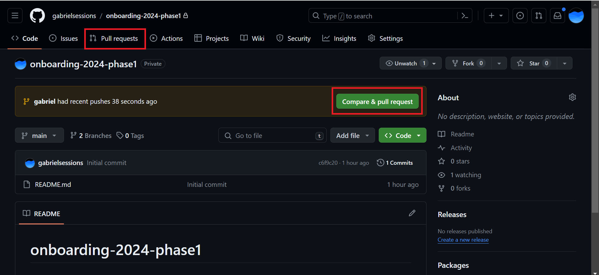
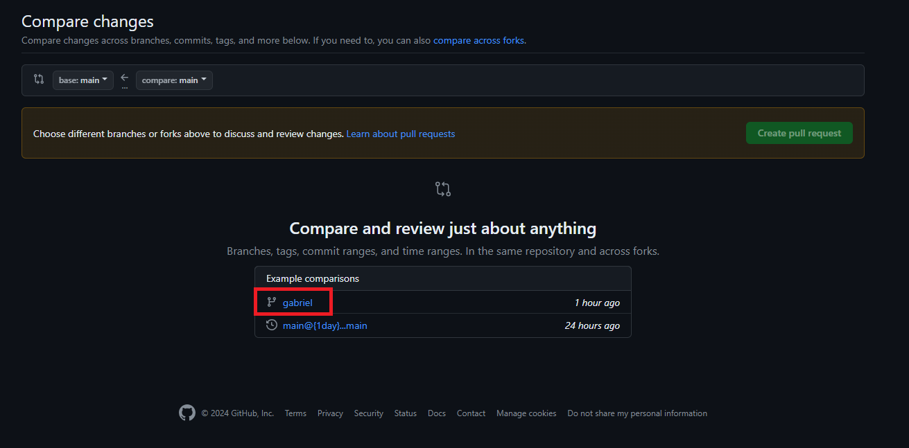
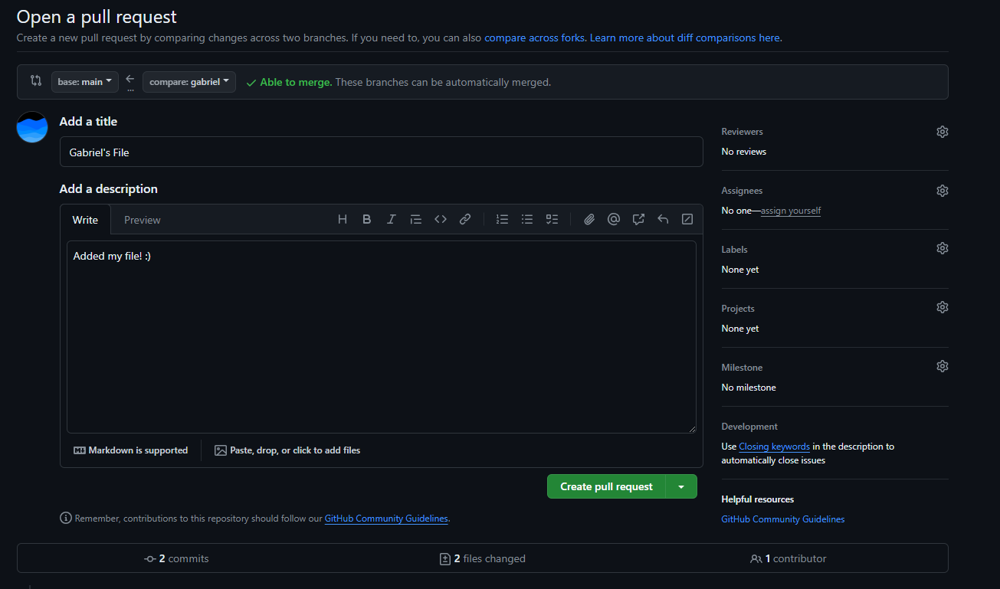
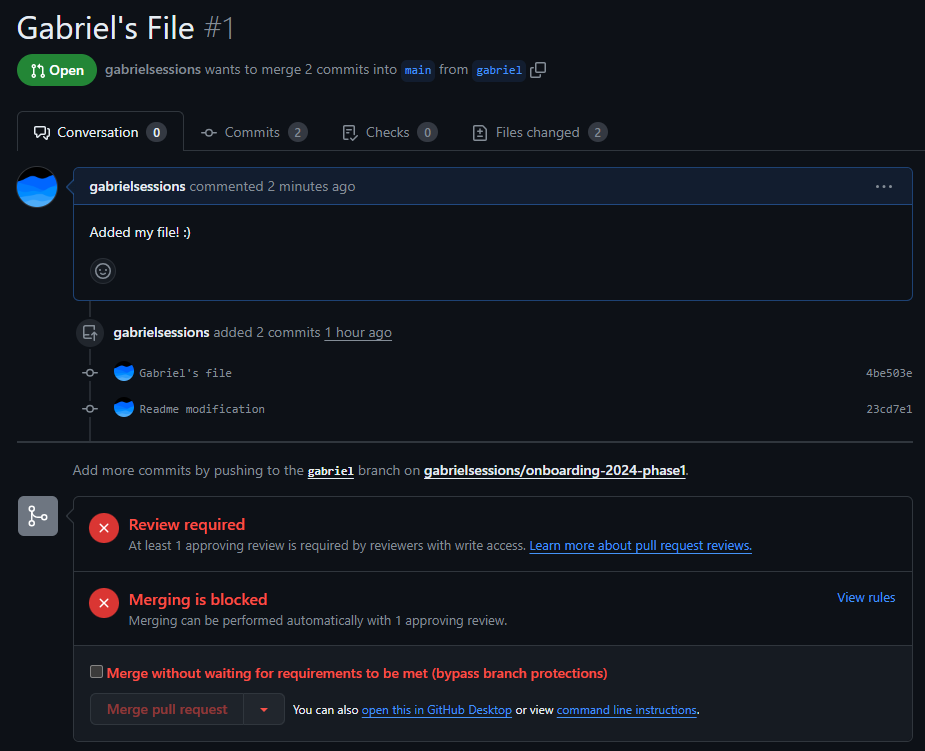

# Phase 1.3: Your First PR!

Before starting this part you should have completed the follwing:
- Cloned the Phase 1 repository
- Created a new branch and added a new file
- Pushed the new file to GitHub

Now head over to Phase 1 repo on [GitHub](https://github.com/gabrielsessions/onboarding-2024-phase1) and click on "Pull Requests". If you see a PR suggestion on the repo main page, feel free to click on that instead and skip the next few steps.

If you're on the PR menu, click the "New Pull Request" button and select your branch from the list of branches. On the branch page, create a new Pull Request (green button towards the top).

Fill out the form with a description of your PR contents and submit the PR

Congratulations! You've submitted your first PR!

You'll notice that you can't merge the changes in yourself. PRs need to be approved by your PM/TL. When you finish a PR, let them know so they can review your code and merge in your changes. You can add them as a "Reviewer" on the PR or ping them on Slack/text.

For this phase, add a PM/TL or Gabriel as a reviewer and we'll take a look at your code before merging it into the main branch.