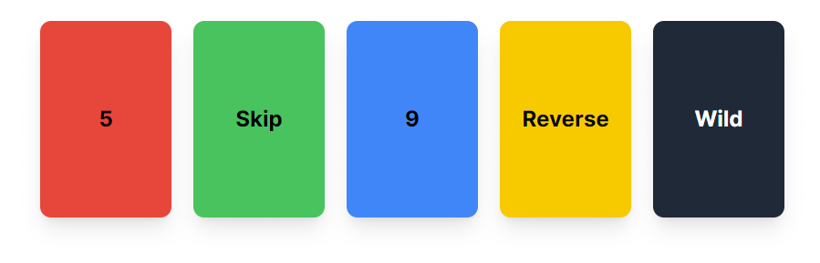

# Phase 2.2: Initializing Cards

Open up the Phase 2.2 page in the codebase and navigate to the page in your browser.

In the process of learning React, we'll build a partially complete implementation of the card game Uno! If you don't know how to play, here are the rules in [text](https://www.unorules.com/) and [video](https://www.youtube.com/watch?v=FkuqYtE1rw0) form.

Display a hand of cards using the Card component provided. We've have an example on how to display a card in the codebase. Create a starting hand of 5 predefined cards and display them on the Phase 2.2 page. We will be dynamically generating them later, so don't spend too much time getting everything perfect.

Your final hand should look something like this:
